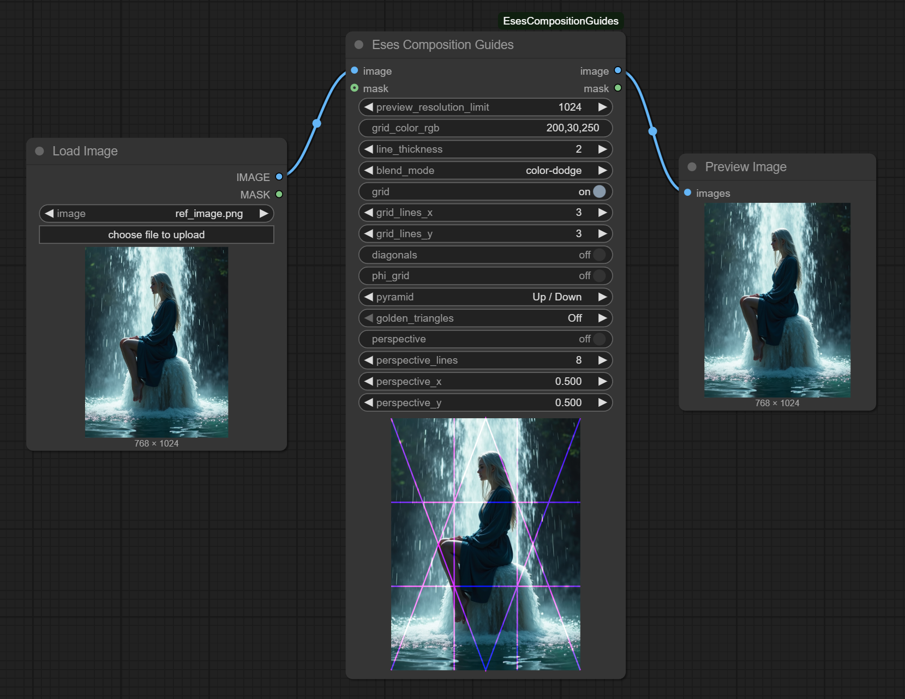

# Eses Composition Guides



## Description

The 'Eses Composition Guides' is a ComfyUI custom node designed as a comprehensive, non-destructive visualization tool for artists. It overlays a wide array of customizable compositional guides onto a live preview of your image, allowing for precise analysis and planning without altering the image that is passed through the workflow.

This node is designed for artists and creators as a single tool to aid in composition. All settings are controlled via simple widgets with instant feedback, and the node is optimized to handle large images without slowing down the UI.

If you have ComfyUI installed, you don't need any extra dependencies!

## Features

* **Live Preview**:
    * The node displays a preview of the connected image with the selected guides overlaid.
    * All guides update in real-time as you adjust their settings, providing instant visual feedback.

* **Comprehensive Guide Library**:
    * **Grid**: A standard grid with customizable row and column counts.
    * **Diagonals**: A simple X-cross to find the center and main diagonal lines.
    * **Phi Grid**: A grid based on the Golden Ratio (1.618) for classic compositional balance.
    * **Pyramid**: Draws triangular guides with options for "Up / Down", "Left / Right", or "Both" orientations.
    * **Golden Triangles**: Overlays triangles based on the Golden Ratio, with options for different diagonal sets.
    * **Perspective Lines**: A powerful single-point perspective guide with a movable vanishing point (X and Y) and an adjustable number of lines.

* **Customizable Appearance**:
    * Full control over the color (RGB or RGBA) and blend mode of the guide lines to ensure visibility against any image.

* **Performance & Quality of Life**:
    * **Non-Destructive**: The node is a pass-through tool, meaning it never modifies the original image or mask.
    * **Resolution Limiter**: A `Preview Res Limit` setting ensures a smooth UI experience by downscaling very large images for the preview only.
    * **Automatic Resizing**: The node's preview area automatically adjusts to match the aspect ratio of the input image.
    * **Clean UI**: Controls are consolidated into logical groups and dropdowns to save screen space.

## Requirements

* PyTorch – (you should have this if you have ComfyUI installed).
* A modern web browser that supports the HTML5 Canvas element.

## Installation

1.  **Navigate to your ComfyUI custom nodes directory:**
    ```
    ComfyUI/custom_nodes/
    ```
2.  **Clone this repository:**
    ```
    git clone https://github.com/quasiblob/ComfyUI-EsesCompositionGuides.git
    ```
3.  **Restart ComfyUI:**
    * After restarting, the "Eses Composition Guides" node will be available in the "Eses Nodes/Visualization" category.

## Folder Structure

```
ComfyUI-EsesCompositionGuides/
├── init.py                     # Main module defining the custom node.
├── composition_guides.py       # The Python file containing the node logic.
├── js/                         # Folder for JavaScript files.
│   └── composition_guides.js   # Frontend logic for the interactive node preview.
└── README.md                   # This file.
```

## Usage

Connect an `image` to the input. You'll have to press 'Run' once, then the node will display a preview of the image. Use the widgets on the node to toggle and configure the various compositional guides. All changes will be reflected instantly in the preview area. The original image is passed through the `image` output for use in the rest of your workflow.

## Inputs

* **image** (`IMAGE`): The input image to display in the preview.
* **mask** (`MASK`, *optional*): An optional mask input, which is passed through.

## Outputs

* **image** (`IMAGE`): A passthrough of the original, unmodified input image.
* **mask** (`MASK`): A passthrough of the original, unmodified input mask.

## Category

Eses Nodes/Visualization


## Contributing

- Feel free to report bugs and improvement ideas in issues, though I may not have time to fix or add anything.

## License

- (Not yet specified)

## About

-

## Disclaimer

This custom node for ComfyUI is provided "as is," without warranty of any kind, express or implied. By using this node, you agree that you are solely responsible for any outcomes or issues that may arise. Use at your own risk.


## Acknowledgements

Thanks to the ComfyUI team and community for their ongoing work!